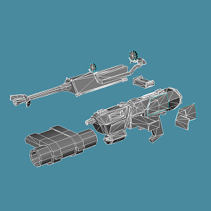
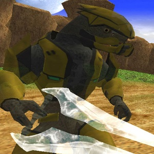
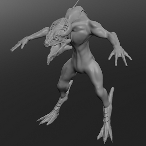
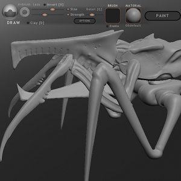

  
  
  
  

  Ongoing off and on 3D hobby work that started with an eye towards use in video game modifications.
Originally started out years ago with projects in the now defunct Gmax 3D application making models
for Grand Theft Auto San Andreas, those projects never made it ingame but laid the foundation for
building my techniques once I delved further into the discipline.  When I got involved in the Star Wars
Battlefront modding community, I increased the rate of asset creation and tackled a wide range of items,
from vehicles, to weapons, to fully rigged character models.  A few of my released models (under the screen
name vf501) saw and or still see a fair amount of use in popular mods for the game.
  After taking a hiatus from the community I worked towards developing my skills further and started to teach
myself next-gen asset creation starting with Hard-Surface subdivision modeling and 3D Sculpting. Nothing at 
this stage made it into any games as my attention in this area dropped, however I did build up a good amount
of skill in this area.  Skill that with the increase in availability of 3D printing I plan to leverage in order
to make products such as toy part replacements, miniatures and project parts as needed.

